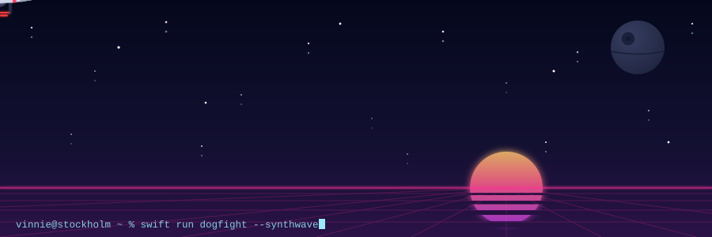
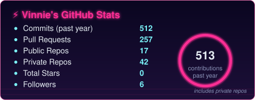
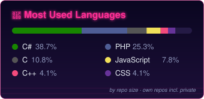
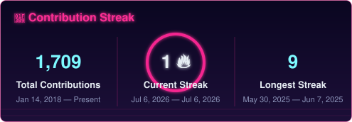
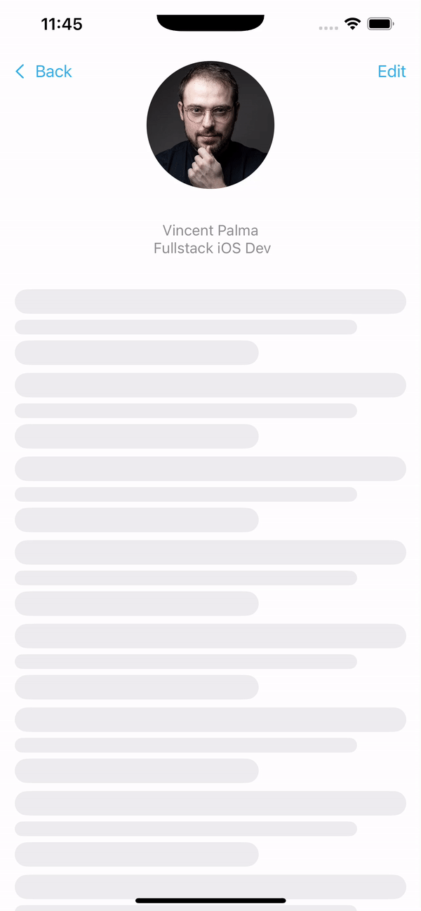

# Hi, I'm Vinnie 👋

## 🚀 What I do

- 💼 **Bonnier News** — native iOS development, internal tools and ad SDKs for iOS & React Native
- 🌱 Currently building with **iOS, macOS, Kotlin Multiplatform and Node.js**
- 🎹 Fueled by synthwave
- 📫 Reach me at **avipami@gmail.com**

## 🛰️ Side projects

| App | Status |
| --- | --- |
| **Max Altitude** | 🟢 On the App Store |
| **VeloSaver** | 🟢 On the App Store |
| **Hamstra** | 🟡 Soon on App Store / Google Play |
| **Kasa** | 🟡 Soon on the App Store |
| **OurSaga** · **Hittad** · **Nästa** · **Pucko** | 🧪 In the lab |

## 🧰 Tech stack

  

## 📊 Stats

  
  
   
  

## 🐍 Contribution snake

  <picture>
    <source media="(prefers-color-scheme: dark)" srcset="https://raw.githubusercontent.com/avipami/avipami/output/snake-dark.svg"/>
    
  </picture>

## 📱 Latest fun

  

---

  ⭐ From Stockholm with 🎹 — <em>these aren't the bugs you're looking for.</em>

