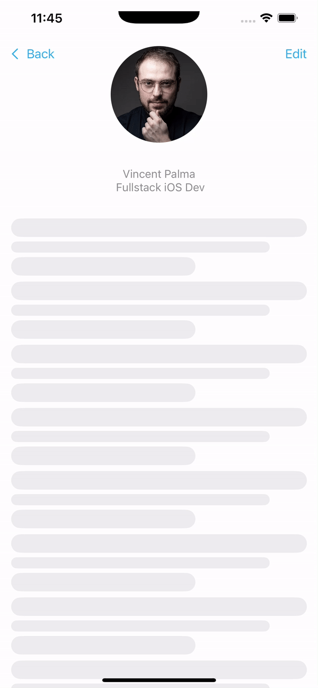

<h1 align="center">Hi 👋, I'm Vinnie</h1>
<h3 align="center">A passionate IoT / iOS Developer from Sweden!</h3>

- 🤓 Current workplace, **Bonnier News**

- 🔭 My current private projects **Tillsammans, Pour, Kasa**

- 🌱 I’m currently working with **iOS, macOS**

- 📫 How to reach me **avipami@gmail.com**

- ⚡ Fun fact **I make homemade Ramen**

<h3 align="left">Connect with me:</h3>

<h3 align="left">Languages and Tools:</h3>

             

<h3 align="center">Latest Fun:</h3>

